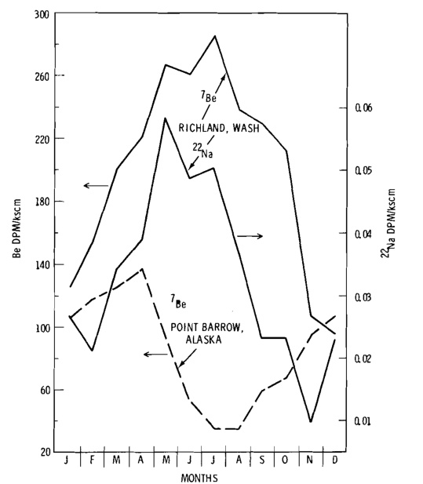

.Radionuclide Concentration in Surface Air at Richland, Washington (Neg 760669-1)

image::../images/ref_atmospheric_fallout_1975_richland_point_barrow_figure-1.png[A grid of 7 x 5 scatterdot graphs that show the amount of a given isotope's level of decay in the atmosphere. For all graphs, the x axis = year tested between 1961 - 1976 in increments of 1 year. There are two sets of data in each graph. In the top section of each graph, the y axis = decay per minute over kscm compounds at increments of (1) 0, (2) 0.01, (3) 0.1, (4) 1.0, and (5) 10 dpm/kscm. In the bottom section of each graph, the y axis = megatons of the same isotope detected in the atmosphere with increments of (1) 0.02 - 0.1, (2) 0.1 - 1, (3) 1 - 10, and (4) > 10 megatons. The detonations from each nation are denoted as a solid line for the United States, a dotted line for the U.S.S.R., and a dashed line for China.]

.7 x 5 Table for Isotopes in Figure 1

include::../modules/ref_atmospheric_fallout_1975_richland_point_barrow_figures_table-1.adoc[]

.Radionuclide Concentration in Surface Air at Point Barrow, Alaska (Neg 760669) 

image::../images/ref_atmospheric_fallout_1975_richland_point_barrow_figure-2.png[A grid of 7 x 5 scatterdot graphs that show the amount of a given isotope's level of decay in the atmosphere. For all graphs, the x axis = year tested between 1961 - 1976 in increments of 1 year. There are two sets of data in each graph. In the top section of each graph, the y axis = decay per minute over kscm compounds at increments of (1) 0, (2) 0.01, (3) 0.1, (4) 1.0, and (5) 10 dpm/kscm. In the bottom section of each graph, the y axis = megatons of the same isotope detected in the atmosphere with increments of (1) 0.02 - 0.1, (2) 0.1 - 1, (3) 1 - 10, and (4) > 10 megatons. The detonations from each nation are denoted as a solid line for the United States, a dotted line for the U.S.S.R., and a dashed line for China.]

.7 x 5 Table for Isotopes in Figure 2

include::../modules/ref_atmospheric_fallout_1975_richland_point_barrow_figures_table-2.adoc[]

NOTE: Concentrations are in disintegrations per 1000 standard cubic meters (dpm/kscm).

NOTE: _*_ denotes analysis still in progress.

.Monthly Averages of Atmospheric ^7^Be from 1964 to 1967 and ^22^Na from 1967 to 1975

