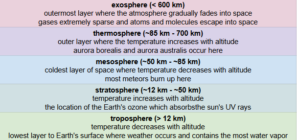

[id="ref_basic-diagrams_{ref-basic-diagrams}"]
include::../attributes.adoc[]

== Placeholder Name

.Layers of the Atmosphere

From the outermost layer to the layer closest to Earth's surface:

* The *exosphere: (over 600 km):* is the outermost layer of the atmosphere that gradually fades into space. The gases are extremely sparse, and the atmos and the molecules escape into space.

* The *thermosphere (approx. 85 km to 700 km):* is the outer layer of the atmosphere where the temperature _increases_ with altitude. The aurora borealis and the auora australis occur here.

* The *mesophere (approx. 50 km to 85 km):* is the coldest layer of space where the temperature _decreases_ with altitude. Most meteors burn up in this layer.

* The *stratosphere (approx. 12 km to 50 km):* is the location of Earth's ozone, which absorbs the sun's ultraviolet (UV) rays. The temperature _decreases_ with altitude.

* The *troosphere (up to the first 12 km):* is the lowest layer of Earth's atmosphere where weather occurs and contains the most water vapor. The temperature _decreases_ with altitude.

.Cations vs. Anions
image::../images/ref_basic_anion_cation_diagram.png[Two isotopes next to each other. On the left (1), there is an image labeled "Cation", a negatively charged ion, that contains 4 neutrons, 4 protons, and 5 electrons. On the right (2), there is an image labeled "Anion", a positively charged ion, that contains 4 neutrons, 4 protons, and 3 electrons.]