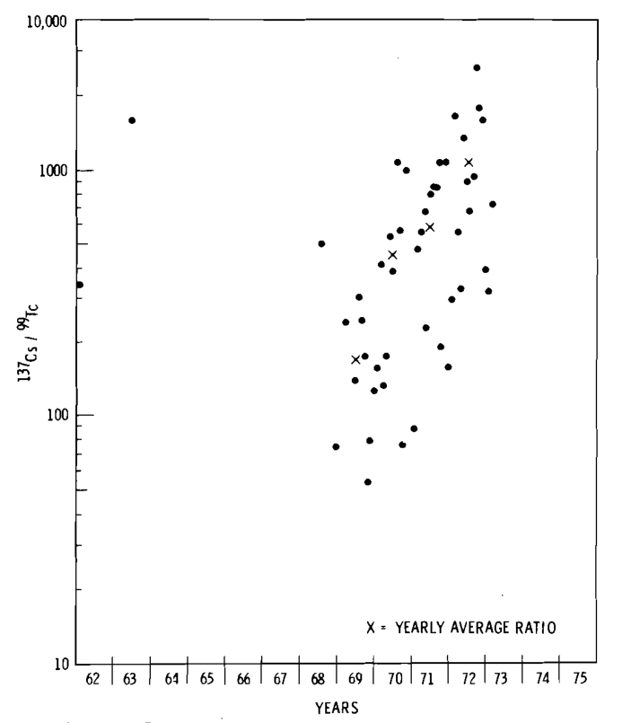

.Disintegration Rate Ratio of ^241^Pu/^239^Pu in Air at Richland, Washington (Neg 761052-2)

image::../images/ref_concentrations_241_pu_and_99_tc_figure-1.png[A scatter dot graph which shows the amount of radioactive decay for ^241^Pu/^239^Pu in Richland Washington. The graph is split into two parts on top of each other. For both graphs, the x axis = year tested between 1961 - 1976 in increments of 1 year. In the top section of the graph, the y axis = disintegration rate ratio in increments of (1) 0, (2) 10, and (3) 100 dpm/kscm. In the bottom section of each graph, the y axis = megatons of the same isotope detected in the atmosphere with increments of (1) 0.02 - 0.1, (2) 0.1 - 1, (3) 1 - 10, and (4) > 10 megatons. The detonations from each nation are denoted as a solid line for the United States, a dotted line for the U.S.S.R., and a dashed line for China.]

.Radionuclide Concentration Lin Surface Air at Richland, Washington (Neg 761052-1)
image::../images/ref_concentrations_241_pu_and_99_tc_figure-2.png[A scatter dot graph which shows the amount of the ^99^Tc isotope concentration in Richland Washington. The graph is split into two parts on top of each other. For both graphs, the x axis = year tested between 1961 - 1976 in increments of 1 year. In the top section of the graph, the y axis = ddisintegration rate ratio in increments of (1) 0, (2) 0.001, (3) 0.01, and (4) 1.0 dpm/kscm. In the bottom section of each graph, the y axis = megatons of the same isotope detected in the atmosphere with increments of (1) 0.02 - 0.1, (2) 0.1 - 1, (3) 1 - 10, and (4) > 10 megatons. The detonations from each nation are denoted as a solid line for the United States, a dotted line for the U.S.S.R., and a dashed line for China.]

.Disintegration Rate Ratios of ^137^Cs to ^99^Tc (Neg 761052-3)
