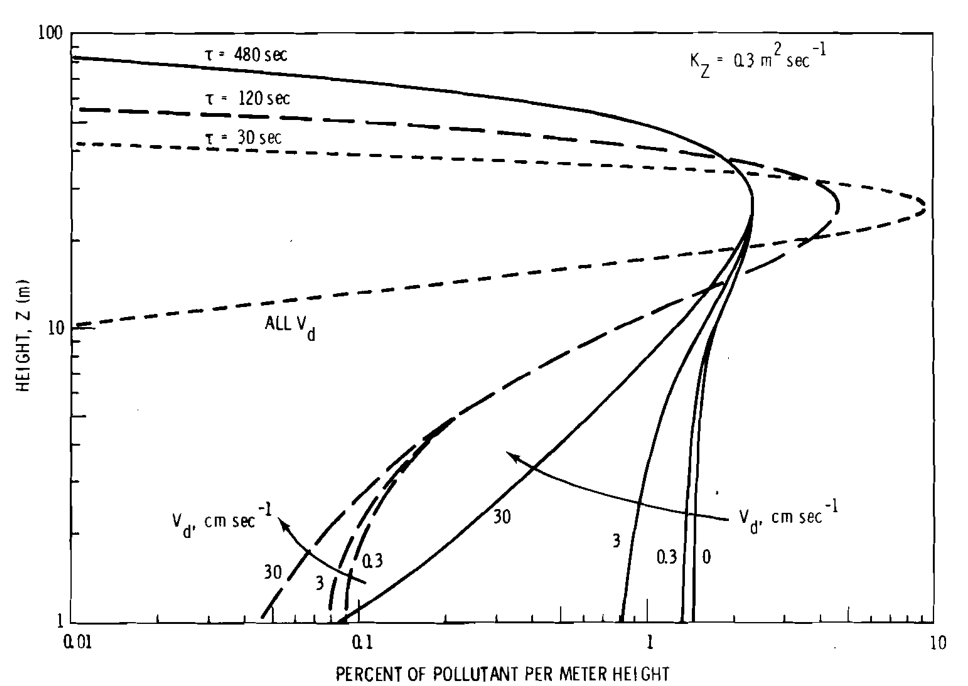

[id="ref_diffusion_with_deposition_at_short_range_figures_{ref-diffusion-deposition-short-range-1}"]

.Vertical Profiles of Fraction of Tracer Per Unit Height for Nickola and Clark's test V-6 (Neg 741011-4)

image::../images/ref_diffusion_with_deposition_at_short_range_figure-1.png[A dot graph which shows • tracking Krypton (Kr) at a transversal of 200 meters, ◦ tracking Krypton (Kr) at a transversal of 842 meters, □ tracking Florine (FP) at a transversal of 200 meters, and ■ tracking Florine (FP) at a transversal of 842 meters. The x axis = percent of tracer in meters from 0 m - 7 m in increments of 1. The y axis = height in meters from 0 m - 60 m in increments of 5 m. A dashed line (- - -) highlights the release height, which is just above 25 m. A dotted line highlights the top sampler at a transversal of 200 m. Another dotted line highlights the top sampler at a traversal of 842 m. All areas under curves normalized to 100%.]

_Total amounts of tracers were normalized to 100%._

.A Plot of the Theoretical Results Derived in the Text
#u# and v~d~  as shown and h = 26 m. The x axis = percent of pollutant per meter with increments of (0) 0.01, (1) 0.1, (2) 1, and (3) 10. The y axis = height for Z in meters with increments of (1) 1, (2) 10, and (3) 100. The base assumption is K~Z~ = 0.3 m2 sec^-1^. The lines in the graph, from top to bottom, left to right, include (1) t = 480 seconds, (2) t = 120 seconds, (3) t = 30 seconds, (4) all Vd, (5) V~d~ cm sec^-1^, and (6) V~ở~ cm sec^-1^ . Data points highlighted on the, from left to right include (1) 0.045, 30, (2) 0.07, 3, (3) 0.1, 0.3, (4) 0.2, 30, (5) 0.8, 3, and (6) 1.15, 0.]