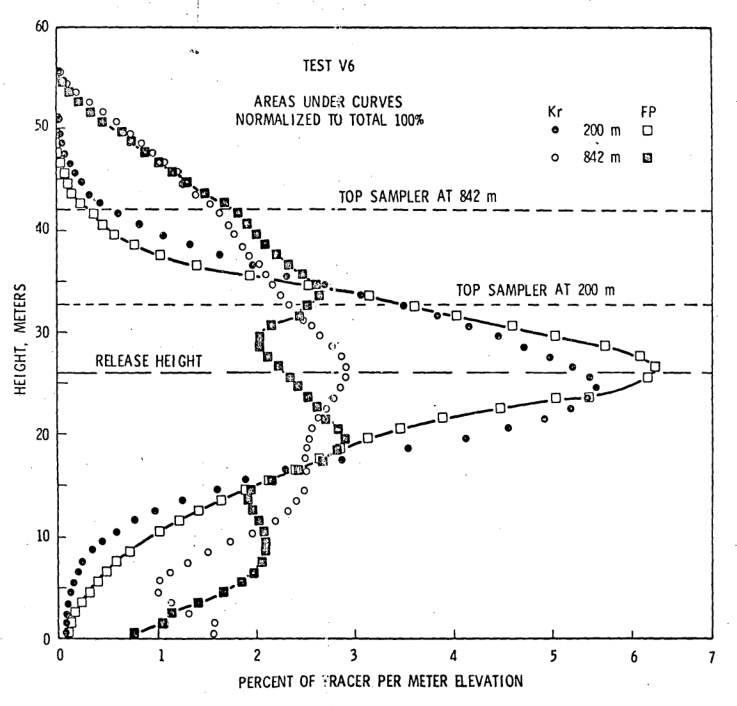
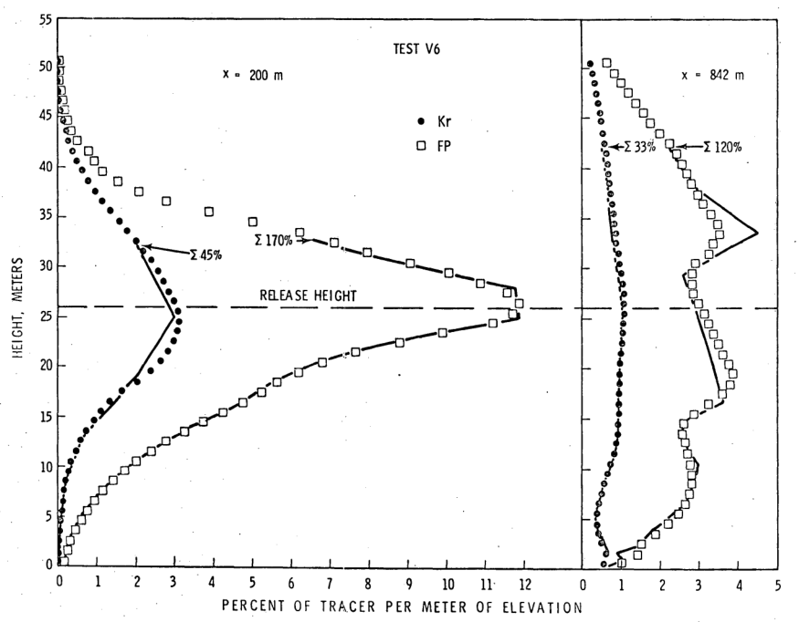

.Test V6, Kr at 842 m, height in meters against azimuth in degrees
image::../images/ref_measurement_of_particulate_plume-figure-1.png[]

_E/Q sec/m^3^ x 10^-6^, x = 642 m, Kr_

.Test V6, FP at 842 m, height in meters against azimuth in degrees
image::../images/ref_measurement_of_particulate_plume-figure-2.png[]

_E/Q sec/m^3^ x 10^-6^, x = 642 m, FP_

.Test V6, Height in meters x percent of tracers per meter elevation

_Areas under curves normalized to 100%_

.Test V6, height in meters x percent of tracer per meter elevation

_x = 200 m vs. x = 842 m_

.Test V5, height in meters x percent of tracer per meter elevation
image::../images/ref_measurement_of_particulate_plume-figure-5.png[]

_x = 812 m vs. x = 200_

.Test V6, height in meters x percent of tracer per meter elevation
image::../images/ref_measurement_of_particulate_plume-figure-6.png[]

_x = 842 vs. x = 200_

.Test V7, height in meters x percent of tracer per meter elevation
image::../images/ref_measurement_of_particulate_plume-figure-7.png[]

_x = 867 m vs. x = 200 m_

.Test V5, V6, and V7, height in meters c percent of tracer per meter elevation
image::../images/ref_measurement_of_particulate_plume-figure-8.png[]

_V5 where x = 812 m, V6 where x - 842 m, and V7 where x = 200 m_