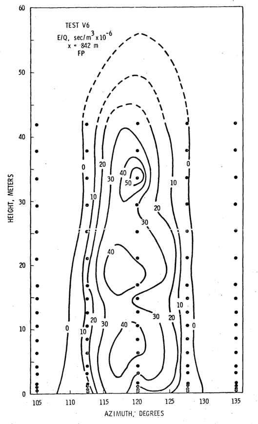
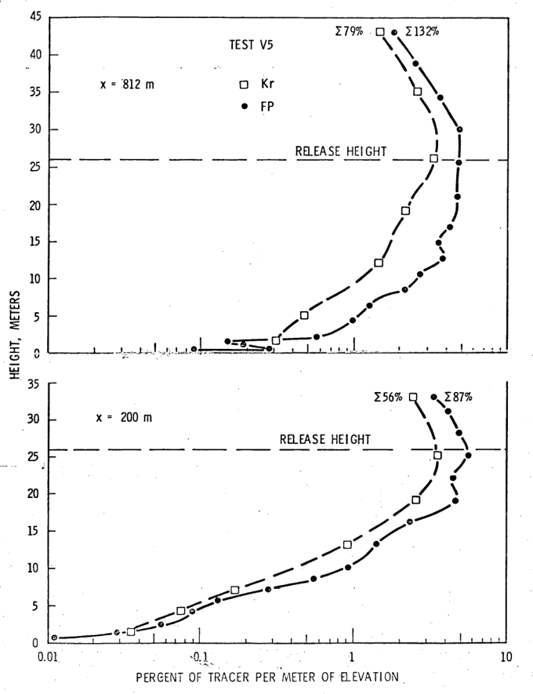
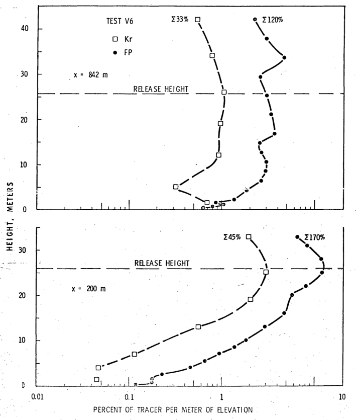
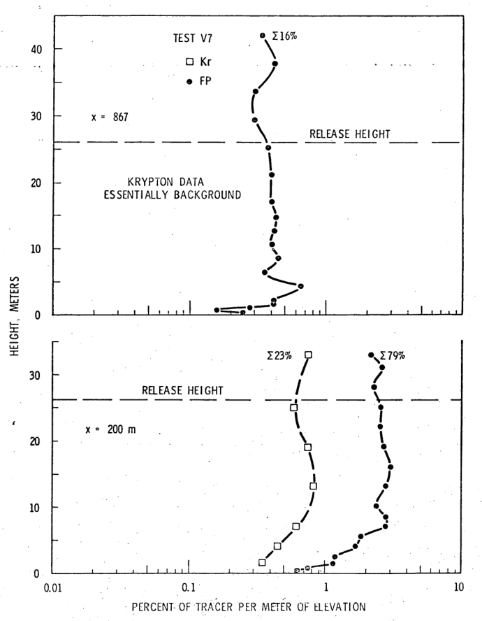
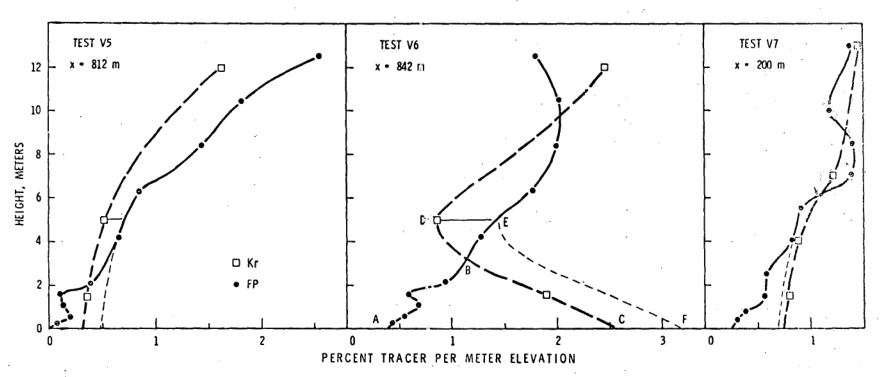

.Test V6, Kr at 842 m, height in meters against azimuth in degrees
image::../images/ref_measurement_of_particulate_plume-figure-1.png[A graph which shows the electrical field strength for a transversal of 842 to the tops of the towers. This graph is for the transversal of 842 m for the element Krypton (Kr). The x axis = azimuth from 105 degrees - 135 degrees in increments of 5 degrees. The y axis = height from 0 meters - 60 meters in increments of 5 meters.]

.Test V6, FP at 842 m, height in meters against azimuth in degrees

.Test V6, Height in meters x percent of tracers per meter elevation
image::../images/ref_measurement_of_particulate_plume-figure-3.png[A dot graph which shows • tracking Krypton (Kr) at a transversal of 200 meters, ◦ tracking Krypton (Kr) at a transversal of 842 meters, □ tracking Florine (FP) at a transversal of 200 meters, and ■ tracking Florine (FP) at a transversal of 842 meters. The x axis = percent of tracer in meters from 0 m - 7 m in increments of 1. The y axis = height in meters from 0 m - 60 m in increments of 5 m. A dashed line (- - -) highlights the release height, which is just above 25 m. A dotted line highlights the top sampler at a transversal of 200 m. Another dotted line highlights the top sampler at a traversal of 842 m. All areas under curves normalized to 100%.]

.Test V6, height in meters x percent of tracer per meter elevation
image::../images/ref_measurement_of_particulate_plume-figure-4.png[A dot graph which shows • tracking Krypton (Kr) and □ tracking Florine (FP). It is split into two sections vertically. The x axis for both = percent of tracer per meter of elevation. The first side shows 0 percent - 12 percent with increments of 1 percent for a transversal of 200 m. The second side shows 0 percent to 5 percent with increments of 1 percent for a transversal of 842 m. The y axis = height in meters from 0 m - 55 m in increments of 5 m. A dashed line (- - -) highlights the release height, which is just above 25 m. Data points of (1) a sum of 45 percent Kr and (2) a sum of 170 percent FP are highlighted on the left side. Data points of (1) a sum of 35 percent of Kr and (2) a sum of 120 percent of FP on the right side.]

.Test V5, height in meters x percent of tracer per meter elevation

.Test V6, height in meters x percent of tracer per meter elevation

.Test V7, height in meters x percent of tracer per meter elevation

.Test V5, V6, and V7, height in meters c percent of tracer per meter elevation
