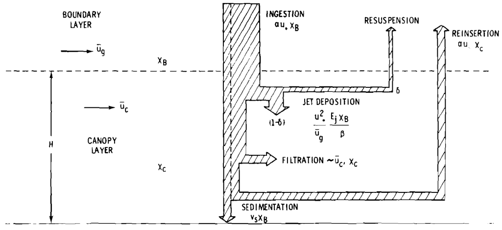
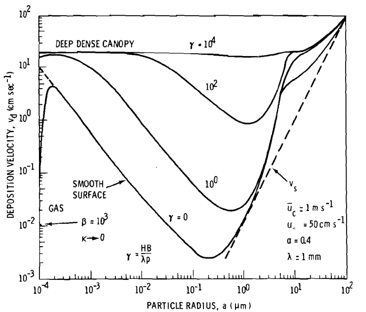

[id="ref_modeling_preliminaries_for_dry_deposition_to_a_canopy_figures_{assembly-modeling-preliminaries-deposition-figures}"]
include::../attributes.adoc[]

.Assumed Pollutant Fluxes in a Canopy (Neg. 754519-13)

[listing]
----
CANOPY LAYER (Inside Vegetation)

                                                ▲ Reinsertion:
      [ u_C = Mean Canopy Velocity ]            │ α u_* χ_C
                                                │
             │
             │ Jet Deposition:                  ○ [ χ_C = Concentration ]
             │ (u_*^2 E_j / u_g β) χ_B          │
             ▼                                  │ Filtration:
      ┌──────────────┐                          │ ~ u_C χ_C
      │ RESUSPENSION │ ◄────── δ (Fraction)     ▼
      └──────┬───────┘
             │
             ▼ 1-δ (Net Deposition)
_____________________________________________________________________

SURFACE / GROUND
----

.A Plot of Eq. (3) with the Removal Rate Given by Eq. (6) (Neg 754519-6)

A graph that demonstrates a significant increase in a deposition velocity for particles smaller than about 10 μm, with increases in canopy height H or biomass B. There is a similar increase of vd with increasing wind speed within the canopy ūc. The increase in vd with decreasing characteristic dimension of the collectors, λ, is even more dramatic because of the concomitant increase in the collection efficiency. At the left-hand side of the plot is qualitatively indicated at the possible reduction in vd fir gases because of the nonatmospheric effects. This reduction can be significantly less in a canopy (compare the dashed and solid portions of the Υ = 10° curve) because of the increased collector area.