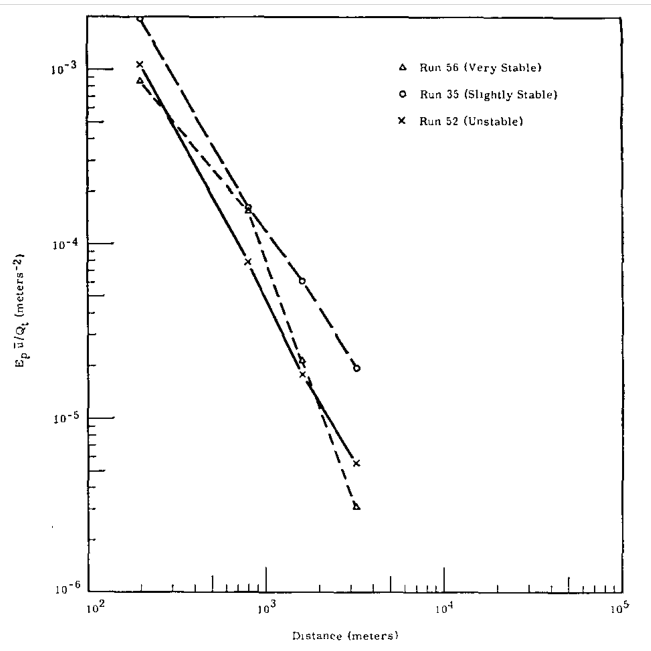
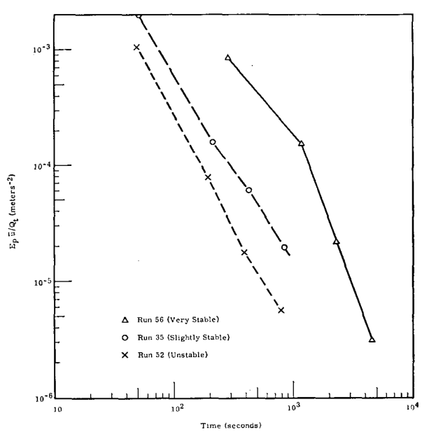
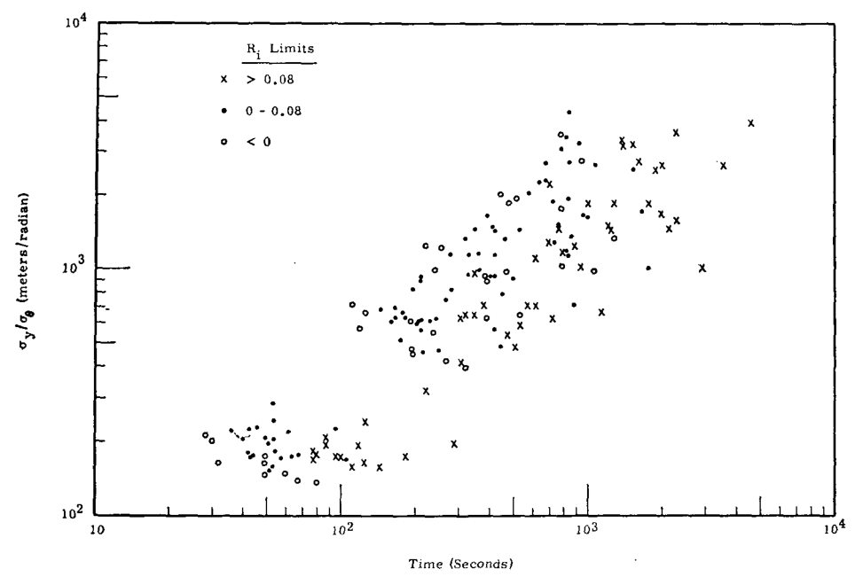
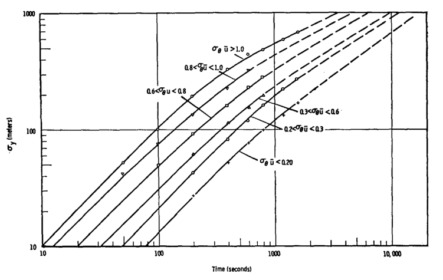
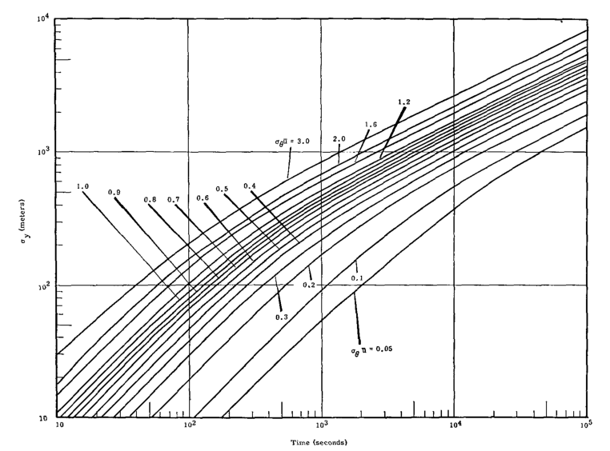

.Normalized peak exposure _E~q~/qr_, vs. distance for diffusion tests with differing conditions of atmospheric stability

.Normalized peak exposure, _E~p~ū/Qr_ vs. time for diffusion test with differing conditions of atmospheric stability

.Ratio of plume standard deviation to the product of wind tests with differing conditions of atmospheric stability

.Ratio of plume standard deviation to wind azimuth standard deviation mean wind speed, _σ~y~/σ~θ~ū_, vs. time
image::../images/ref_prediction_of_environmental_exposures_fig-4.png[A scatterplot graph that displays the R1 limits where x > 0.08, • = 0-0.08, and ◦ = < 0. The x axis = _time (seconds)_. It shows a scale with increments at (1) 10, (2) 10^2^, (3) 10^3^, and (4) 10^4^. The y axis = _σ~y~/σ~θ~ū_. It shows a scale with increments at (1) 10^1^, (2) 10^2^, (3) 10^3^, and (4) 10^4^.]

.Crosswind plume standard deviation _σ~y~_, as a function of time and _σ~θ~ū_

.Standard deviation of plume width as a function of travel time and wind variability

.Normalized peak exposure, _E~p~ū/Q~T~_, vs, time
image::../images/ref_prediction_of_environmental_exposures_fig-7.png[A line graph with six data points show. The top two are, left to right: (1) Unstable, Ri < 0, 0.4 < _σ~θ~ū_ < 0.8 and (2) Stable (Ri > (0.08), _σ~θ~ū_ < 0.15. The remaining three are, left to right: (3) Unstable (Ri < 0). 0.8 < _σ~θ~ū_ < 1.4, (4) Slightly Stable, 0 < Ri < 0.08, 0.15 < _σ~θ~ū_ < 1.1, and (5) Stable (Ri > 0.08), 0.15 < _σ~θ~ū_ < 0.5. The x axis = time (seconds). It shows increments at (1) 10, (2) 10^2^, (3) 10^3^, and 10^4^. The y axis = _E~p~ū~/Q~t~_ (meters^-2^). It shows increments at (1) 10^-6^, (2) 10 ^-5^, (3) 10^-4^, and (4) 10^-3^.]