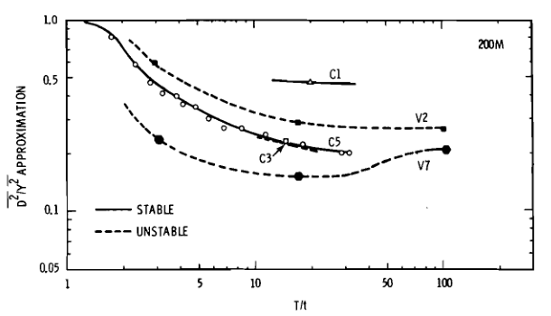
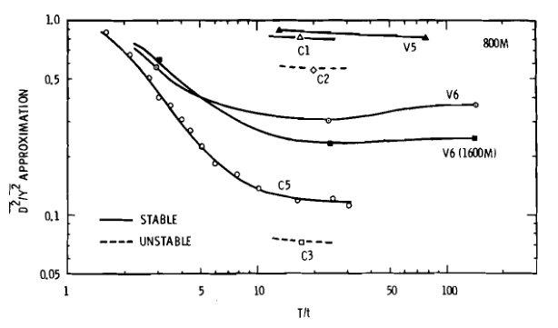

[id="ref_some_observations_of_the_relative_contribution_of_real_plume_figures_{ref-some-observations-relative-contribution-real-plume-1}"]
include::../attributes.adoc[]

.Meteorology and General Character of the Plume During Experiment V6 (Neg 753125-1)

image::../images/ref_some_observations_of_the_relative_contribution_of_real_plume_figure-1.png[Two graphs on top of one another. (1) The top graph shows how the wind (atmospheric temperature profile) changes with regard to height 800 meters from the source. The x axis = temperature in degrees Fahrenheit in increments of (1) 60 and (2) 65 degrees. The y axis = height in meters in increments of (1) 0, (2) 10, (3) 20, and (4) 30 meters. (2) The second graph shows the path of the plume over time comparing one minute (--) and 10 seconds (- - -). The x axis = minutes in increments of (1) 0, (2) 5, (3) 10, and (4) 15 minutes. The y axis = 28 degrees Fahrenheit.]

.Meteorology and General Character of the Plume During Experiment V7 (Neg 753125-4)

image::../images/ref_some_observations_of_the_relative_contribution_of_real_plume_figure-2.png[Two graphs on top of one another. (1) The top graph shows how the wind (atmospheric temperature profile) changes with regard to height in meters 200 meters from the source. The x axis = temperature in degrees Fahrenheit in increments of (1) 0, (2) 10, (3) 20, and (4) 30 meters. The y axis = 54 degrees Fahrenheit. The second graph shows the path of the plume over time comparing 10 seconds (--) and one minute (- - -). The x axis = time in minutes in increments (1) 0, (2) 5, (3) 10, and (4) 15 minutes. The y axis = 54 in degrees Fahrenheit.]

.The Ratio of Diffusion in Short Plume Segments to Diffusion in the Mean or Apparent Plume as a Function of Observation Times at 200 Meters from the Source (Neg 72182-1)

.The Ratio of Diffusion in Short Plume Segments to Diffusion in the Mean or Apparent Plume as a Function of Observation Times at 200 Meters from the Source (Neg 72182-2)

