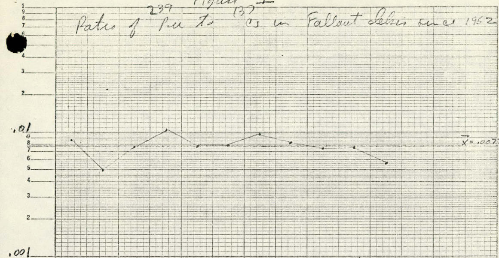
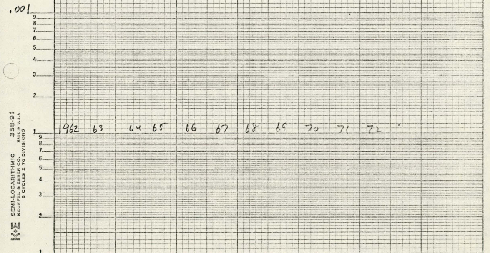
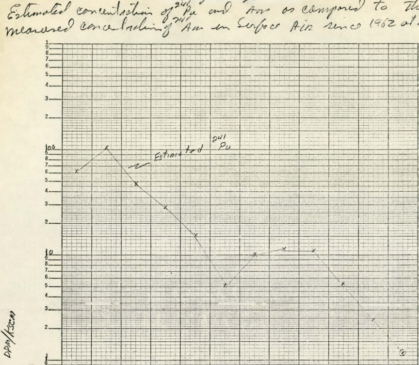
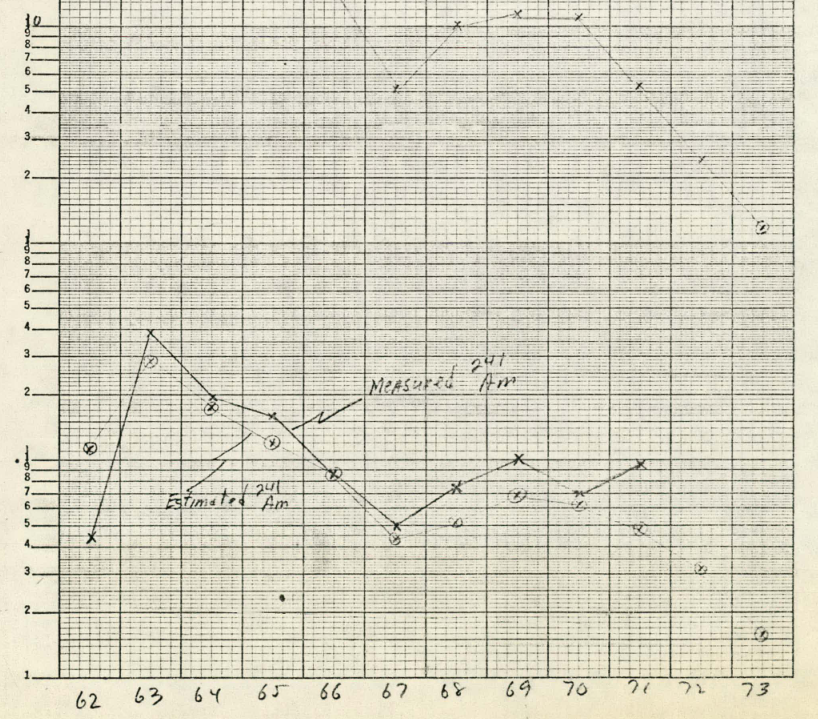

.Ratio of ^239^Pu to ^132^Cs in Fallout Debris [illegible] 1952

.Ratio of ^239^Pu to ^132^Cs in Fallout Debris [illegible] 1952

.Ratio of ^239^Pu to ^132^Cs in Fallout Debris [illegible] 1952
image::../images/ref_transuranium_elements_in_the_atmosphere_figure-3.png[A line graph drawn on physical graphing paper with no x or y axis labeled.]

.^238^Pu and ^239^Pu Concentrations in Surface Air at Richland, Washington
image::../images/ref_transuranium_elements_in_the_atmosphere_figure-4.png[Three scatterplots on top of each other showing, from top to bottom: (1) 238~Pu~, (2) 239~Pu~, and (3) 238~Pu~/239~Pu~. The x axis = the year including 1961 through 1963 in single year increments for each graph. The y axis = _dpm/KSCM_ in increments of (1) 0.01, (2) 0.1, and (3) 1. At the bottom is a fourth graph, a bar graph. The data points are labeled as "Detonations" for (1) the U.S., (2) the U.S.S.R., and (3) the Chinese. A final label is included, "^238^Pu from SNAP-9A BURNUP" but it is unclear what that means. The x axis = the year including 1961 through 1963 in single year increments. The y axis is unlabeled but shows increments of (1) 0.02 - 0.1 MT, (2) 0.1 - 1 MT, (3) 1.10 MT, and (4) > 10 MT. At the bottom, someone scratched out a label that read, "NEβ 726084-2".]

.Estimated Concentration of ^241^Pu and ^241^An as compared to the measured concentration of ^241^Am in Surface Air since 1982 at Richland

.Estimated Concentration of ^241^Pu and ^241^An as compared to the measured concentration of ^241^Am in Surface Air since 1982 at Richland
